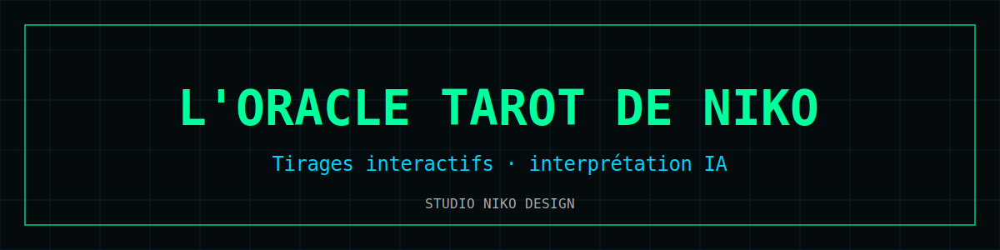

# L'Oracle Tarot de Niko

  

Application de **tirage de tarot avec interprétation par IA** — streaming des réponses en temps réel, clé API protégée par coffre chiffré.

**Démo** : [nikoju1977.github.io/tarot-de-niko](https://nikoju1977.github.io/tarot-de-niko/)

## Fonctionnalités

- 🎴 Tirages interactifs avec animations
- ✨ Interprétations générées par **Mistral AI** en streaming **SSE**
- 🔐 Coffre **AES-256-GCM** (PBKDF2) pour la clé API — jamais stockée en clair
- 🌐 Relais **Vercel Edge Function** (la clé ne transite pas côté client en production)
- 📱 Mobile-first, installable

## Stack

`HTML/CSS/JS single-file` · `Mistral AI (SSE)` · `Web Crypto API` · `Vercel Edge Functions`

## Lancer en local

Ouvrir `index.html`, saisir une clé Mistral (chiffrée localement à la volée).

## Licence

[MIT](LICENSE) © 2026 Nicolas Julienne — Studio Niko Design
