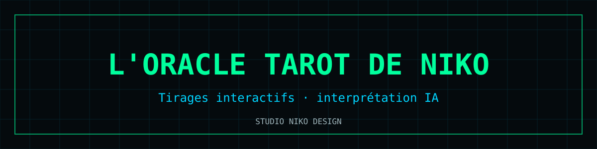

# L'Oracle — Tarot de Niko

[Démo sur GitHub Pages](https://nikoju1977.github.io/tarot-de-niko/) · [Licence MIT](LICENSE)

Application web de tarot de Marseille, inspirée de l'approche psychologique de Jodorowsky, avec interprétation facultative par Mistral AI.

## Fonctionnalités

- Tirages interactifs de 3, 4, 5 ou 6 cartes, parmi 78 arcanes.
- Interprétation IA en streaming SSE et questions de suivi.
- Lecture vocale et reconnaissance vocale lorsque le navigateur les prend en charge.
- PWA installable, avec ressources locales accessibles hors ligne (l'IA nécessite une connexion).

## Confidentialité et clé API

Le site fonctionne **entièrement dans le navigateur** : il ne comporte **aucun serveur applicatif, proxy Vercel ou coffre chiffré** dans ce dépôt.

Si tu saisis une clé Mistral, elle est gardée **en mémoire pendant la consultation uniquement** et envoyée **directement au service Mistral par HTTPS**, avec le texte de ton tirage et de tes questions. Elle n'est plus enregistrée dans localStorage ; les anciennes clés qui y étaient conservées sont supprimées au chargement.

Une clé saisie côté navigateur n'est pas secrète vis-à-vis du propriétaire de l'appareil, des extensions installées ou des outils de développement. Utilise une clé personnelle aux droits et quotas limités. Sans clé, le tirage des cartes reste disponible, mais pas l'interprétation IA. Si l'appel échoue pour des raisons de CORS ou de réseau, un relais serveur correctement configuré sera nécessaire.

## Démarrage

Ouvre [la démo HTTPS](https://nikoju1977.github.io/tarot-de-niko/) ou sers localement le dossier :

`python3 -m http.server 8000`

Puis va sur http://localhost:8000/ (certaines fonctions exigent HTTPS ou un contexte sécurisé).

## Tests

Avec **Node.js 22 ou plus récent** :

`node --test tests.js`

La suite vérifie la syntaxe JS, les 78 cartes, la lecture SSE, la non-persistance de la clé API, ainsi que les chemins et le cache PWA.

## Stack technique

HTML · CSS · JavaScript natif · APIs Web du navigateur · Mistral AI REST/SSE · Service Worker · GitHub Pages.

## Licence

[MIT](LICENSE) © 2026 Nicolas Julienne — Studio Niko Design
